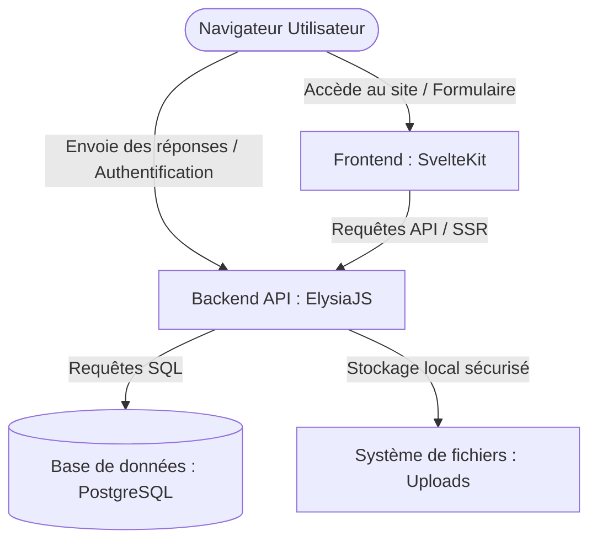

# 🌱 OpenForms

> Une alternative **éthique**, moderne, open-source et auto-hébergeable à Google Forms.  
> Conçue avec **Svelte 5 (Runes)**, **ElysiaJS** et **Prisma**, entièrement propulsée par le runtime **Bun**.

---

## 🌟 Fonctionnalités Clés

### 🛠️ Builder de formulaires par Glisser-Déposer
* **Types de champs complets** : Texte court, paragraphe, email, nombre, choix unique (radio), choix multiple (checkbox), liste déroulante, date, date-heure, fichier (téléchargement sécurisé), grille d'évaluation.
* **Validation avancée** : Obligatoire, longueur min/max, expressions régulières (Regex), bornes numériques.
* **Options éthiques** : Consentement RGPD explicite, anonymisation optionnelle des réponses, chiffrement au repos.

### 📊 Tableur d'Administration « Excel-like » (Fait Maison)
* **Édition directe** : Double-clic sur une cellule pour modifier la réponse avec **sauvegarde automatique** en arrière-plan.
* **Moteur de calcul intégré** : Supporte les fonctions `SUM`, `AVG`, `MIN`, `MAX`, `MEDIAN`, `COUNT`, `CONCAT(...)` ainsi que des formules arithmétiques personnalisées par ligne (ex: `=note*2`).
* **Tri & Filtres** : Recherche globale, tri par colonne et filtres multi-critères.
* **Import / Export** : Importation et exportation réelles de fichiers `.xlsx` (Excel) et `.csv`.

### 🔒 Sécurité renforcée
* **Authentification robuste** : Hachage Argon2id via `Bun.password`, sessions par cookie sécurisé `HttpOnly`.
* **Protections intégrées** : Validation stricte des données avec Typebox, en-têtes de sécurité, jetons CSRF (Double-Submit Cookie), limitation de requêtes (rate-limiting) et CORS restreints.
* **Chiffrement au repos** : Clés AES-256-GCM pour protéger les réponses et fichiers sensibles directement en base de données.


---

## 🏗️ Architecture du Projet

Le projet est structuré sous forme de monorepo (Bun Workspaces) avec une séparation nette entre le frontend et l'API backend :



### Structure des dossiers
```
Formulaire_Humanitour/
├── backend/                     # API ElysiaJS (Bun)
│   ├── prisma/
│   │   ├── schema/              # Schéma Prisma multi-fichiers (Prisma 6+)
│   │   └── seed.ts              # Amorce : Super Admin + formulaire de démo
│   └── src/
│       ├── config/env.ts        # Validation stricte des variables d'env
│       ├── services/            # Base de données, cryptographie et chiffrement
│       ├── middleware/          # CORS, headers, sessions, CSRF, rate-limit
│       ├── controllers/         # Endpoints d'API (auth, users, forms, responses...)
│       └── index.ts             # Point d'entrée de l'API & Swagger
│
└── frontend/                    # Application SvelteKit + Svelte 5 (SPA / SSR Node)
    └── src/
        ├── lib/
        │   ├── components/      # FormBuilder, Tableur, FieldInput...
        │   ├── api/client.ts    # Client API typé avec gestion automatique du CSRF
        │   └── formulaEngine.ts # Évaluateur de formules arithmétiques sécurisé
        └── routes/              # Routes et pages SvelteKit (Administration et Remplissage)
```

---

## 🐳 Déploiement Rapide avec Docker (Recommandé)

C'est la méthode la plus propre et la plus simple pour démarrer l'application avec sa base de données.

### 1. Prérequis
Assurez-vous d'avoir installé :
* [Docker](https://www.docker.com/)
* [Docker Compose](https://docs.docker.com/compose/)

### 2. Démarrage
Lancez simplement la commande suivante à la racine du projet :
```bash
docker compose up --build -d
```

Cette commande va :
1. Démarrer une base de données PostgreSQL prête à l'emploi.
2. Compiler et démarrer le backend ElysiaJS (Bun).
3. Lancer automatiquement les migrations de base de données Prisma et charger les données de démonstration (`db:seed`).
4. Compiler et lancer le frontend SvelteKit (Node.js).

### 3. Accès
* **Frontend** : [http://localhost:5173](http://localhost:5173)
* **API Backend** : [http://localhost:3535](http://localhost:3535)
* **Documentation Swagger (API)** : [http://localhost:3535/docs](http://localhost:3535/docs)

---

## 💻 Installation pour le Développement Local (Sans Docker)

Si vous préférez exécuter l'application localement sur votre machine :

### 1. Prérequis
* [Bun](https://bun.sh) (version 1.1 ou supérieure)
* Une base de données PostgreSQL en cours d'exécution.

### 2. Configuration de la base de données & Secrets
Dans le répertoire `backend/`, dupliquez le fichier `.env.example` en `.env` et ajustez les variables :
```bash
cd backend
cp .env.example .env
```
Générez les secrets obligatoires requis pour démarrer l'application :
```bash
# Générer la clé de chiffrement AES (doit décoder en exactement 32 octets)
openssl rand -base64 32

# Générer le secret de session / CSRF (clé robuste aléatoire)
openssl rand -base64 48
```
Renseignez également votre `DATABASE_URL` pointant vers votre instance PostgreSQL.

### 3. Installation et Lancement
Depuis la racine du projet, installez les dépendances globales :
```bash
# Installation des dépendances (utilise bun ou npm selon votre environnement de proxy)
bun install
```

> **Note sur le proxy TLS :** Si vous travaillez derrière un proxy d'entreprise qui bloque la validation SSL de `bun install`, vous pouvez installer les packages en utilisant `npm install` (les répertoires `node_modules` resteront compatibles avec le runtime Bun).

Préparez la base de données (génération du client Prisma, migrations et seed) :
```bash
# Générer le client Prisma
bun run db:generate

# Lancer les migrations
bun run db:migrate

# Insérer le Super Admin et le formulaire de démo
bun run db:seed
```

Démarrez les serveurs de développement en parallèle :
```bash
# Lance le frontend et le backend simultanément
bun run dev
```

* Le frontend de développement sera accessible sur : [http://localhost:5173](http://localhost:5173)
* Le backend de développement sera accessible sur : [http://localhost:3535](http://localhost:3535)

---

## ⚙️ Configuration (Variables d'Environnement)

### Backend (`backend/.env`)

| Variable | Description | Valeur par défaut |
| :--- | :--- | :--- |
| `DATABASE_URL` | URL de connexion PostgreSQL | **Requis** |
| `PORT` | Port d'écoute de l'API | `3535` |
| `NODE_ENV` | Mode de l'application | `development` ou `production` |
| `FRONTEND_ORIGIN` | Liste des origines CORS autorisées (séparées par des virgules) | `http://localhost:5173` |
| `ENCRYPTION_KEY` | Clé AES-256-GCM encodée en base64 (exactement 32 octets décodés) | **Requis en production** |
| `SESSION_SECRET` | Secret de signature des sessions et jetons CSRF | **Requis en production** |
| `SESSION_TTL` | Durée de vie d'une session de connexion (en secondes) | `604800` (7 jours) |
| `COOKIE_SECURE` | Cookies envoyés uniquement via HTTPS | `false` (`true` en production) |
| `UPLOAD_DIR` | Dossier de stockage des fichiers envoyés | `./uploads` |
| `MAX_UPLOAD_BYTES`| Taille limite par fichier envoyé (en octets) | `10485760` (10 Mo) |
| `SEED_ADMIN_EMAIL`| Email du compte Super Admin généré au premier lancement | `admin@example.org` |
| `SEED_ADMIN_PASSWORD`| Mot de passe du compte Super Admin généré | `ChangeMoi!2026` |

### Frontend (`frontend/.env` ou variables d'environnement système)

* **`VITE_API_BASE`** : L'URL publique d'accès à l'API backend. Par défaut `http://localhost:3535`. Lors de la construction de l'image Docker, cette variable est passée via l'argument de build `VITE_API_BASE`.

---

## 🚀 Mise en Production

En dehors de Docker Compose, pour compiler manuellement pour la production :

```bash
# Compilation du backend et du frontend
bun run build

# Démarrage du backend en production
cd backend && bun run start

# Démarrage du frontend (serveur Node.js autonome via adapter-node)
cd frontend && node build
```

Assurez-vous de :
1. Configurer un reverse-proxy (ex: Nginx, Caddy ou Traefik) devant l'application pour gérer le certificat SSL/TLS.
2. Basculer `COOKIE_SECURE` à `true`.
3. Renseigner des clés de production sécurisées pour `ENCRYPTION_KEY` et `SESSION_SECRET`.

---

## 🌐 Domaines personnalisés (multi-domaine)

L'instance peut être servie simultanément sur plusieurs domaines publics (ex: `humanitour.fr` **et** `klaynight.fr`). Comme l'authentification repose sur un cookie de session `SameSite=Lax`, chaque domaine doit voir l'API comme **de même origine** (même domaine, routage par chemin) plutôt que comme une API distante partagée — sans quoi le cookie de session ne circulera pas correctement pour l'un des domaines.

1. **DNS** : chez votre registrar/DNS, créez un enregistrement `A` (et `AAAA` si IPv6) pour chaque domaine/sous-domaine (`humanitour.fr`, `www.humanitour.fr`, `klaynight.fr`, `www.klaynight.fr`) pointant vers l'IP publique du serveur. Cette étape ne peut pas être faite depuis ce dépôt.
2. **Reverse-proxy** : utilisez [`Caddyfile.example`](Caddyfile.example) comme point de départ. Il route `/api/*` et `/docs*` vers le backend et le reste vers le frontend, **pour chacun des domaines**, afin que l'API reste "same-origin" partout.
3. **`FRONTEND_ORIGIN`** (backend) : liste déjà par défaut `https://humanitour.fr,https://www.humanitour.fr,https://klaynight.fr,https://www.klaynight.fr,https://forms.klaynight.fr` dans `docker-compose.yml` — ajustez si vous ajoutez d'autres domaines.
4. **`VITE_API_BASE`** (frontend, au build) : avec un routage par chemin same-origin comme ci-dessus, buildez avec `VITE_API_BASE=""` (vide) pour que le frontend appelle l'API en chemin relatif (`/api/v1/...`), quel que soit le domaine visité.
5. **`COOKIE_SECURE=true`** en production (HTTPS obligatoire pour que les cookies de session traversent correctement chaque domaine).

> **Sous-domaine séparé pour l'API (ex: `forms.klaynight.fr` + `api-forms.klaynight.fr`)** : si vous préférez héberger le frontend et l'API sur deux sous-domaines distincts plutôt qu'un routage par chemin same-origin, l'appel devient une requête cross-origin — deux conditions supplémentaires s'appliquent :
>    - `FRONTEND_ORIGIN` (backend) **doit** lister l'origine exacte du frontend (ex: `https://forms.klaynight.fr`), sinon le navigateur bloque toutes les réponses faute d'en-tête `Access-Control-Allow-Origin` (c'est la cause la plus fréquente d'erreurs CORS après un déploiement).
>    - `VITE_API_BASE` (frontend, au build) doit alors pointer vers l'URL absolue de l'API (ex: `https://api-forms.klaynight.fr`) plutôt que rester vide.

### Lien personnalisé par formulaire

Chaque formulaire dispose d'un onglet **Paramètres → Lien personnalisé** permettant de choisir librement le segment d'URL public (`/f/mon-lien`), en plus du domaine sur lequel il est consulté. Le lien est validé côté API (unicité, format `minuscules-et-tirets`, mots réservés exclus).

---

## 📄 Licence

Ce projet est sous licence **MIT**. Consulter le fichier [LICENSE](file:///c:/Users/PASSEREL/Documents/GitHub/Formulaire_Humanitour/LICENSE) pour plus de détails.
