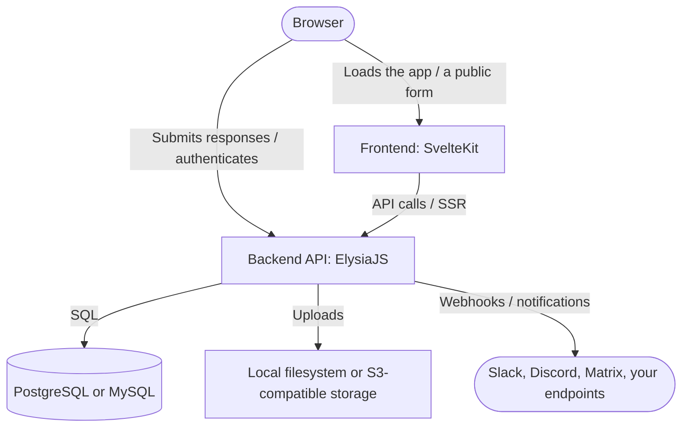

# 🌱 OpenForms

> An **ethical**, modern, open-source and self-hostable alternative to Google Forms.
> Built with **Svelte 5 (Runes)**, **ElysiaJS** and **Prisma**, powered end-to-end by the **Bun** runtime.

[](https://github.com/Klaynight-dev/Openforms/actions/workflows/ci.yml)
[](https://github.com/Klaynight-dev/Openforms/actions/workflows/docker-publish.yml)
[](LICENSE)

🇫🇷 [Lire ce document en français](README.fr.md)

---

## Why OpenForms?

Most form builders make you choose between *convenient* and *respectful of your
respondents*. OpenForms is designed so you don't have to:

- **Your data stays yours.** Self-hosted, no telemetry, no third-party trackers on public forms.
- **GDPR by design.** Explicit consent, optional full anonymisation, AES-256-GCM encryption at rest,
  per-form retention policy with automatic purge, and an exportable processing register.
- **Not a toy.** Conditional logic, multi-page forms, an Excel-like response editor with a formula
  engine, statistics with cross-tabulation, digital signatures, and a native embed widget.
- **Actually self-hostable.** One `docker compose up`, prebuilt images on GHCR, PostgreSQL *or* MySQL.

---

## Quick start

```bash
docker compose up -d
```

That's it — the compose file pulls prebuilt images from
`ghcr.io/klaynight-dev/openforms-backend` and `ghcr.io/klaynight-dev/openforms-frontend`,
starts PostgreSQL, applies the Prisma migrations and seeds a first administrator.

| Service | URL |
|---|---|
| Web UI | <http://localhost:5173> |
| API | <http://localhost:3535> |
| API docs (Swagger) | <http://localhost:3535/docs> |

The seed prints the credentials of the first `SUPER_ADMIN` on the backend's first boot.
**Change the password immediately**, and replace `ENCRYPTION_KEY` / `SESSION_SECRET`
before exposing the instance (see [Production](#production)).

> Building from source instead of pulling images: `docker compose -f docker-compose.yml -f docker-compose.build.yml up --build -d`.

---

## Features

### Drag & drop form builder
Short text, paragraph, email, number, radio, checkbox, dropdown, date, date-time, file upload,
rating grid, checkbox grid, linear scale, digital signature, geographic address, Stripe payment
(demo module), and page breaks for multi-page forms.

- **Conditional logic** — show or hide any field based on a previous answer.
- **Validation** — required, min/max length, regular expressions, numeric bounds.
- **Scheduling & quotas** — opening/closing dates, maximum number of responses.
- **Per-form translations** — publish one form in several languages.
- **Theming / white-label** — logo, colours, custom CSS per form.

### Excel-like response editor
- **Inline editing** with background autosave.
- **Formula engine** — `SUM`, `AVG`, `MIN`, `MAX`, `MEDIAN`, `COUNT`, `CONCAT(...)` plus
  per-row arithmetic (`=score*2`).
- **Sorting, global search and multi-criteria filters.**
- **Real `.xlsx` / `.csv` import and export**, and per-response **PDF export** (signatures included).

### Statistics
Per-question charts, cross-tabulation, correlations, time-of-day analytics, editable chart palettes.

### Integrations
- **REST API** with scoped **API keys** — usable from scripts, n8n, Zapier, CI.
- **Webhooks** with a delivery log, automatic retries and manual replay.
- **Outbound notifications** to Slack, Discord and Matrix.
- **Native embed widget** — drop a form into any website with two lines of HTML, no iframe.
- **Google Forms import** and JSON schema import/export.

### Security & operations
- Argon2id password hashing (`Bun.password`), opaque server-side sessions in `HttpOnly` cookies.
- **SSO via OpenID Connect** (Keycloak, Authentik, Google Workspace, Microsoft Entra ID…).
- Strict Typebox validation, security headers, CSRF double-submit tokens, rate limiting, restricted CORS.
- AES-256-GCM encryption at rest for sensitive responses and files.
- **S3-compatible object storage** (MinIO, Cloudflare R2, Garage, AWS S3) or local filesystem.


---

## Architecture

A Bun-workspaces monorepo with a clean split between the SvelteKit frontend and the ElysiaJS API.


```mermaid
graph TD
    User([Browser]) -->|Loads the app / a public form| FE[Frontend: SvelteKit]
    User -->|Submits responses / authenticates| BE[Backend API: ElysiaJS]
    FE -->|API calls / SSR| BE
    BE -->|SQL| DB[(PostgreSQL or MySQL)]
    BE -->|Uploads| ST[Local filesystem or S3-compatible storage]
    BE -->|Webhooks / notifications| EXT([Slack, Discord, Matrix, your endpoints])
```

```
Openforms/
├── backend/                     # ElysiaJS API (Bun)
│   ├── prisma/schema/           # Multi-file Prisma schema (Prisma 6+)
│   ├── src/
│   │   ├── config/env.ts        # Strict environment validation
│   │   ├── services/            # Database, crypto, storage, mailer, notifications
│   │   ├── middleware/          # CORS, headers, sessions, CSRF, rate limiting
│   │   ├── controllers/         # API endpoints
│   │   └── index.ts             # Entrypoint & Swagger
│   └── tests/                   # bun:test unit and integration tests
├── frontend/                    # SvelteKit + Svelte 5 (SSR via adapter-node)
│   ├── embed/                   # Standalone embed widget (esbuild bundle)
│   └── src/lib/i18n/            # UI translations (en, fr)
├── e2e/                         # Playwright end-to-end tests
└── docs/                        # Self-hosting, API, upgrade guides
```

---

## Documentation

| Guide | |
|---|---|
| [Self-hosting](docs/self-hosting.md) | Docker, reverse proxy, MySQL, S3, backups |
| [Configuration reference](docs/configuration.md) | Every environment variable |
| [REST API & API keys](docs/api.md) | Authentication, scopes, examples |
| [SSO / OIDC](docs/sso.md) | Keycloak, Authentik, Google, Entra ID |
| [Upgrading](docs/upgrading.md) | Version policy and migration procedure |
| [GDPR & retention](docs/gdpr.md) | Retention, purge, processing register |
| [Accessibility](docs/accessibility.md) | WCAG 2.1 AA / RGAA conformance status |
| [Contributing](CONTRIBUTING.md) | Dev setup, conventions, review process |

---

## Local development (without Docker)

Requires [Bun](https://bun.sh) ≥ 1.1 and a running PostgreSQL (or MySQL) instance.

```bash
git clone https://github.com/Klaynight-dev/Openforms.git
cd Openforms
bun install

cp backend/.env.example backend/.env
# Generate the two mandatory secrets:
openssl rand -base64 32   # -> ENCRYPTION_KEY (must decode to exactly 32 bytes)
openssl rand -base64 48   # -> SESSION_SECRET

bun run db:setup          # prisma migrate + seed
bun run dev               # backend :3535 + frontend :5173
```

Run the test suites:

```bash
bun run test          # backend unit + integration (bun:test)
bun run check         # svelte-check + tsc
bun run test:e2e      # Playwright (requires a built frontend)
```

---

## Production

1. Put a TLS-terminating reverse proxy in front of the app — see [`Caddyfile.example`](Caddyfile.example).
2. Set `COOKIE_SECURE=true`.
3. Generate fresh `ENCRYPTION_KEY` and `SESSION_SECRET` values. **Losing `ENCRYPTION_KEY`
   makes every encrypted response permanently unreadable — back it up separately from the database.**
4. List every public origin in `FRONTEND_ORIGIN`.
5. Pin an image tag (`ghcr.io/klaynight-dev/openforms-backend:0.1.0`) rather than `latest`,
   and read [docs/upgrading.md](docs/upgrading.md) before each upgrade.

Full details, including MySQL and S3 setup, are in [docs/self-hosting.md](docs/self-hosting.md).

---

## Contributing

Contributions are welcome — bug reports, translations, and features alike.
Start with [CONTRIBUTING.md](CONTRIBUTING.md) and our [Code of Conduct](CODE_OF_CONDUCT.md).
Security issues should follow [SECURITY.md](SECURITY.md) rather than the public issue tracker.

## License

MIT — see [LICENSE](LICENSE).
